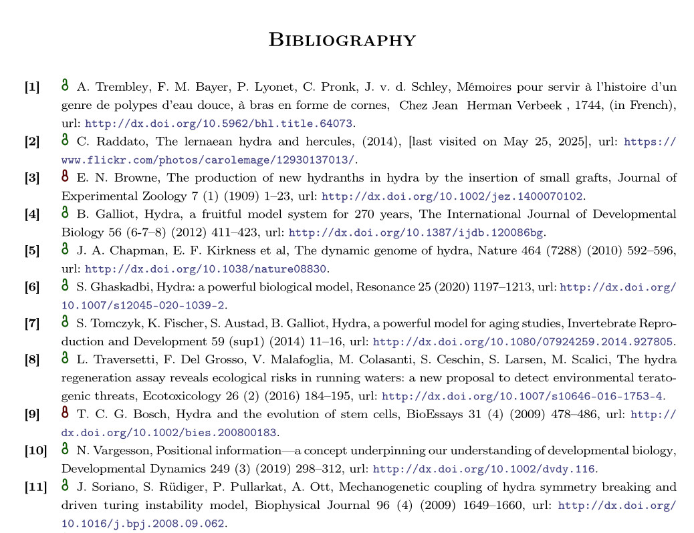

# Access Numerical Bibliography Style

`Version 1.0 by Julius Guthunz`

This is a bibliography style based on the elsart-num style by David Michel and Joris van der Hoeven. Like that one, the citations are cited with consecutive numbering in the order that they first appear in the text. A few things were added to the original style:

- A url field was added to the bibliography for giving the DOI of items
- Titles of articles and books are no longer Locase (in the original style, a title like "On the Empirical Determination of a Distribution Function" would get formatted as "On the empirical determination of a distribution function)
- An optional field "openaccess" is defined, and accessibility of sources is indicated with a small icon
  - If the field does not exist in the bibtex, then it is assumed to be closed access
  - In bibtex, it is set with `openaccess = {true},` or `openaccess = {false},`respectively
 
The icons used were created by Julius Guthunz and are in the public domain. They are optimized for approximately 300dpi on the default text size.

## Example
The following is a screenshot showcasing a bibliography using this style.


This style was inspired by the Wikipedia References. In Wikipedia, freely accessible references are sometimes marked with a small OpenAccess Icon. This is a very useful accessibility feature, allowing people outside of university networks to know instantly whether they have access to the source without a paywall.

## Usage
- Clone the repository and copy the files `access-num.scm`, `NoOpenAccess.png` and `OpenAccess.png` into `$TEXMACS_HOME_PATH/progs/bibtex/`. If you do not know where this folder is located, you can use [find-your-texmacs-paths](https://github.com/Julius-Gu/tm-forge/blob/main/miscellanea/find-your-texmacs-paths.tm) to find it.
- In your bibliography, mark the sources by whether they are freely available. A site like [Unpaywall](https://unpaywall.org/products/simple-query-tool) can help with this.
A citation should look like this:
```
@article{Ravanbodshirazi2023,
  title = {The Nature of the Spark Is a Pivotal Element in the Design of a Miller–Urey Experiment},
  openaccess = {true},
  volume = {13},
  ISSN = {2075-1729},
  url = {http://dx.doi.org/10.3390/life13112201},
  DOI = {10.3390/life13112201},
  number = {11},
  journal = {Life},
  publisher = {MDPI AG},
  author = {Ravanbodshirazi,  Sina and Boutfol,  Timothée and Safaridehkohneh,  Neda and Finkler,  Marc and Mohammadi-Kambs,  Mina and Ott,  Albrecht},
  year = {2023},
  month = nov,
  pages = {2201}
}
```
- In TeXmacs, go to your bibliography, click on `Style` and select `Other...`. Then type `tm-access-num`. Click `OK`.
- Restart TeXmacs and build your document. If everything went well, your bibliography should now look like the screenshot above.
