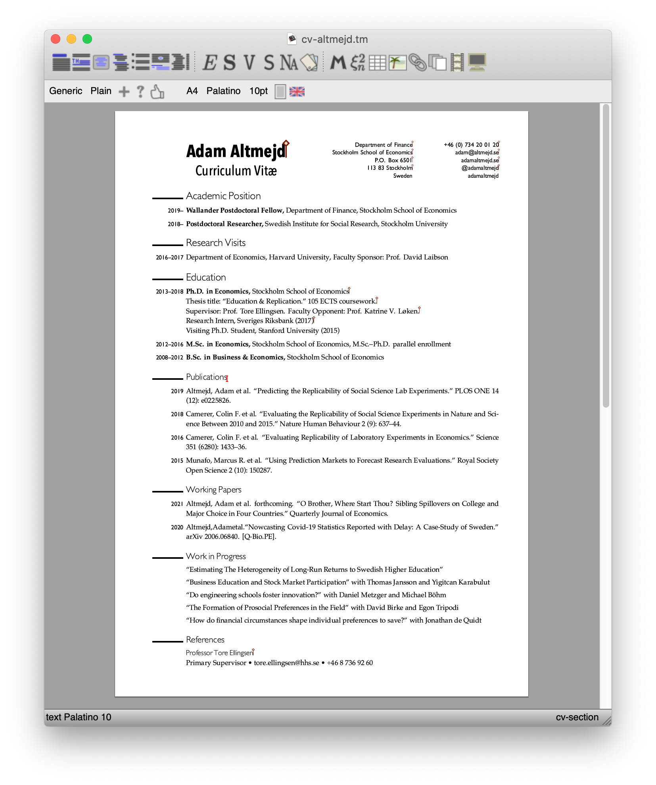

# tm-forge/examples/cv-altmejd

v. 0.5 -- © License Creative Commons CC BY 4.0.

A template for a cv based on the [CV](https://github.com/adamaltmejd/cv) of Adam Altmejd. The original code is distributed under the MIT license and the content of the CV is property of Adam Altmejd.

Adapted for TeXmacs by M. Gubinelli.

An example [PDF output](./cv-altmejd.pdf) and the obligatory screenshot 

