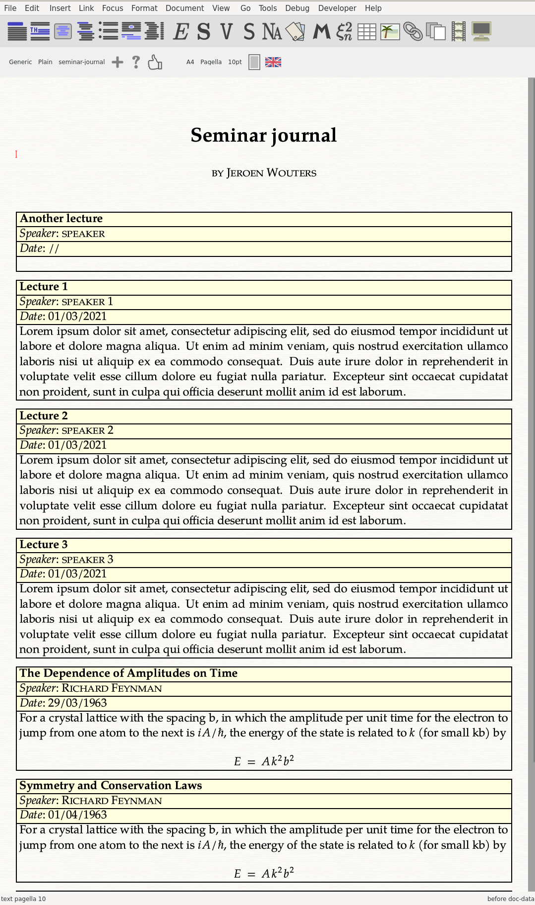

# tm-forge/examples/resume-template

v. 1.0 -- © License Creative Commons CC BY 4.0.

A document for taking notes during talks and seminars, by J. Wouters.

Use the `\entry` macro to add entries. The macro makes the contents searchable in a structured way:

