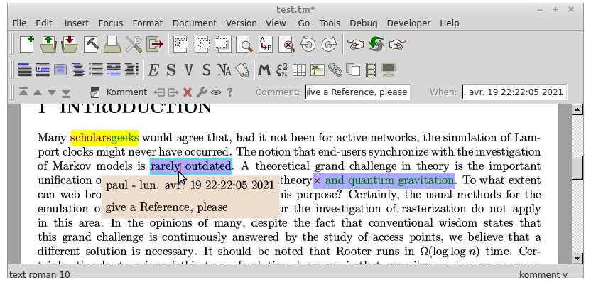
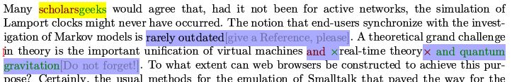
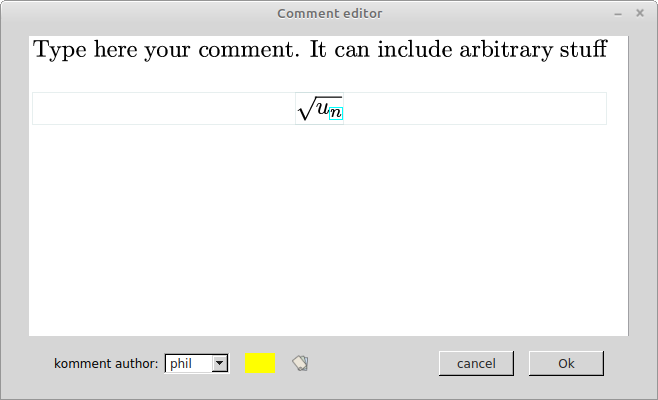

## Tools for handling proposed text changes in (offline) collaborative editing

When working on a draft document as a co-author, one often needs to propose changes to the text, were it for a mere typo,
for clarification purposes, etc. And in some cases you want to justify the proposed change by attaching a comment to it.
Furthermore, after changes are poposed, the process of reviewing them and accepting or rejecting them should be straightforward.

In TeXmacs, the Versioning Tool already provides an easy mechanism to mark changes made to
a document and to revise them, accepting or rejecting them. However it lacks the notion of comments accompanying changes
(it primarily searches differences between _files_ and any added comment would appear as an addition to the text). And
conversely, the recently added Comment package allows making comments, but if one proposes a
change inside such a comment, it is then painful and error-prone to manually implement it. We need the two features combined. 

**This package tries to fill this gap by hacking commenting tools that work hand in hand with the Versioning Tools**.

My commenting tools were developped before the official Comment package became available (and hence it does not make use of it). I have renamed my stuff to Komment, in order to avoid any confusion.

## How it works
This Komment package provides a new "komment" tag for highlighting text chunks one whishes to change and/or comment, together with appropriate commands for introducing and editing that tag. Komments by multiple authors can co-exist and can be given a different highlighting color. Komments are also time-stamped.
 

A komment tag can appear as
 - a pop-up balloon when the cursor enters the highlighted region
 - static inline greyed text (e.g. for printing or pdf export)
 - hidden, i.e. showing only the highlighting, for unencumbered editing.

Within this highlighting markup, proposed text modifications are shown as "version-both" tags (with the comment field possibly empty).

At the time of reviewing comments, TeXmac's Versioning tools are used for navigating between komments,
displaying old or new version of text, and finally, accepting or rejecting proposed changes and clearing comments.

The package uses a style file, scheme macros and widgets. Hopefully it illustrates many aspecs of coding in TeXmacs, including e.g. overloading of existing scheme functions.

## Usage
For a streamlined use, keyboard shortcuts are defined in `my-init-texmacs.scm` (I made no menu, we mostly re-use the Versioning menu).
Below I explain what these do, but they can be defined differently, of course.

#### introducing a komment : Ctl-m 
Select some text beforehand and press Ctl-m. This brings up a text editing widget where you can enter the text of the komment. 
It can be as complicated as you want, contain equations...
At the bottom of the widget, you can change the name of the komment author, and associate a color to that name.


#### Modifying a komment : Ctl-m
You can re-edit an existing komment by placing the cursor in it and pressing again  Ctl-m. 
Be careful to close the widget (pressing OK) when you are done, or you could loose track of which widgets corresponds to which comment and your changes could get lost.

#### Proposing a text change : Ctl-M (think "Modify")
 Select some text beforehand and press Ctl-M. This will automatically introduce a "version-both tag" inside a komment.
 The text that was selected is marked for deletion and the cursor is positionned to enter a replacement text,
 initially set to `×` (i.e. a `<version-suppressed>` tag, meaning it is a pure deletion with no replacement text).
 Conversely, Ctl-M with no initial selection is a pure text addition.
  
At that point the "comment" that could justify the change is empty; it can be added afterwards if needed, with Ctl-m.

#### Circulating between different display styles of the comment field : Ctl-/
When using this keyboard shortcut, the resulting display style is shown in the bottom message bar.

#### Toggle considering komment tags as a version tag.
Only useful when a text contains both "normal"  version tags and komments tags. It tells whether komment tags should be considered or ignored when navigating between the version tags (using the Version menu  `previous difference` or `next difference` or the Ctl-up Ctl-down shortcuts).
 
#### Navigating between koments, control their display, accept or reject changes.

I re-use the shortcuts of the Version tool menu, made more generally available.
  Ctl-up  jump to previous komment 
  Ctl-down jump to next komment
  Ctl-left display old text only
  Ctl-right display proposed new text only
  Ctl-|  display both old and new text
  Ctl-1 retain old text and delete komment  (accept proposed change)
  Ctl-2 retain new text and delete komment (reject proposed change)
If a komment contains no version tag, Ctl-1 and Ctl-2 both clear the komment.

### Installation
Add (merge with prexisting) the `package` and `progs` folders to your ~/.TeXmacs user folder. Then add the definition of the keybord shortcuts to your `my-init-texmacs.scm` (inside the progs folder) 
```
(kbd-map 
  ("C-m" (make-komment))
  ("C-M" (make-correction))
  ("C-/" (circulate-komment-style))
  ("C-:" (toggle-komment-as-version-tag))
  ("C-up" (version-previous-difference))
  ("C-down" (version-next-difference))
  ("C-|" (version-show 'version-both))
  ("C-left" (version-show 'version-old))
  ("C-right" (version-show 'version-new))
  ("C-1" (version-retain 0))
  ("C-2" (version-retain 1))
  )
``` 

### Limitations
As said above, this package is hacked onto existing features. This means for instance that the komment
tag appears as a variant of the version-* tags, which is nonsense (but not overly annoying).
 
Also this code is clearly not a polished, final product, and it may not fulfill your needs or expectations. There are some display quirks, for instance when a comment is inserted in the caption of
a big figure (making it hard to read and edit). This could probably be improved.
