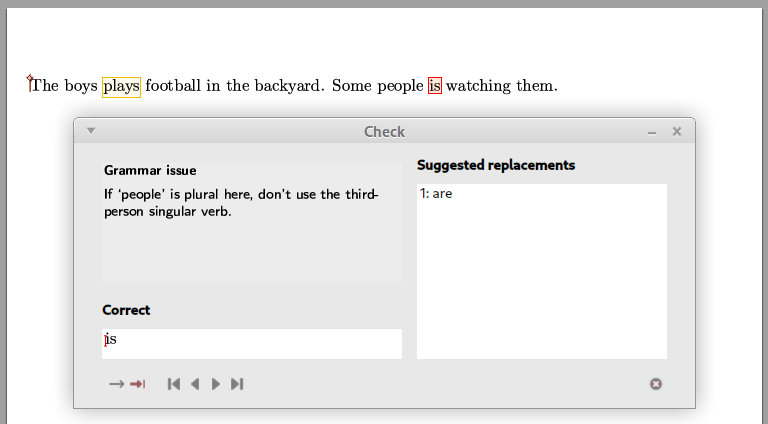

# LanguageTool plugin for TeXmacs
[LanguageTool](https://languagetool.org/dev) is a free, open-source text correction program; it detects spelling, grammar and typography errors in many languages.

The plugin proposed here proofreads TeXmacs documents using a LanguageTool server that can be either

*   [The public server running at languagetool.org](https://dev.languagetool.org/public-http-api).
    
    This is the plugin's default and requires no configuration. Obviously, it requires internet connectivity. However, as of July 2025, the usage of this free service is limited to:
    
    *   20 requests per IP per minute (this is supposed to be a peak value - don't constantly send this many requests, or you would get blocked)
        
    *   75KB text per IP per minute
        
    *   20KB text per request
        
    *   Only up to 30 misspelled words will have suggestions.
        
    
    Thus, for a long document, you'll need to check only chunks at a time.
    
*   A server running locally on your machine.
    
    This approach works offline and does not have the usage limitations of the public server. [Instructions for setting up such a server are given here](https://dev.languagetool.org/http-server).
    
*   [A paid service](https://languagetool.org/premium#anchor-get-premium) provides additional features; it should be straightforward to adapt the plugin for using it.
    

## Plugin installation

Copy the `languagetool` folder to your `~/.TeXmacs/plugins` user folder (If you want to find the exact location of your TeXmacs home folder in your system [use this file](https://raw.githubusercontent.com/texmacs/tm-forge/main/miscellanea/find-your-texmacs-paths.tm).).

After TeXmacs is restarted, a new menu item Tools→LanguageTool check... should appear, with a keyboard shortcut Meta-\*. In case the menu item and shortcut are not immediately available, do Tools→Update→Plugins.

If you want to change the default server, the menu location or the keyboard shortcut, edit the `~/.TeXmacs/plugins/outline/progs/init-languagetool.scm` file.

## Usage

The workflow for proofreading a document with this plugin closely follows that of TeXmacs ' built-in spellchecker.

When invoked through the menu or the keyboard shortcut, the plugin will check the current selection, if any, or the whole document. The interface for displaying and correcting errors is then based on the spellchecker widget and works similarly (the bottom toolbar version, or the sidetool version are not implemented at this point).

When multiple similar errors are found, you get the opportunity to accept or correct them all at once, or to review each of them individually.

At present, there is no provision to add words to a persistent user dictionary; Accepted new words are remembered only during the current TeXmacs session.

## Additional information :

The plugin needs the `curl` program accessible in the `PATH`, for communicating with the server.

## Reporting bugs – Contributing improvements

The plugin was developed on Linux and may need some adaptations on Windows or macOS.

Testing was limited and you can expect to encounter bugs. The plugin is nevertheless already valuable as it detects a variety of issues in yours texts that would have previously gone unnoticed.

If you find a reproducible way to have the plugin misbehave, please **do not** report it to TeXmacs' official bug tracker. Instead, file a bug report at [tm-forge](https://github.com/texmacs/tm-forge/issues), attaching to your report _a maximally simplified version_ of your document that allows reproducing the bug and explain the steps to reproduce it.

You are welcome to propose [pull requests at tm-forge](https://github.com/texmacs/tm-forge/pulls) for improving this plugin.