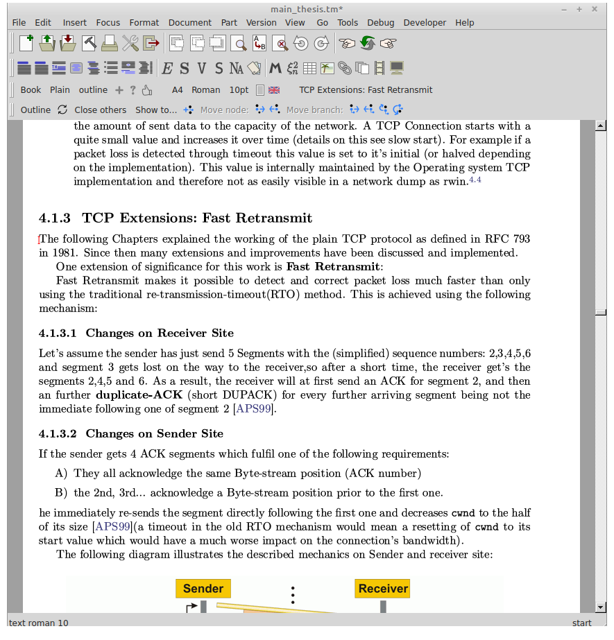
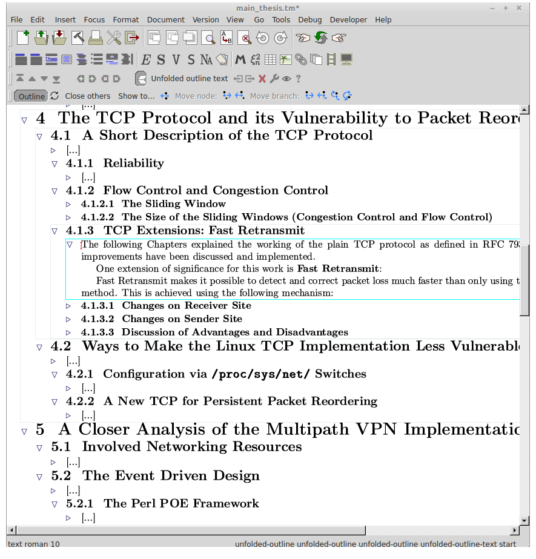
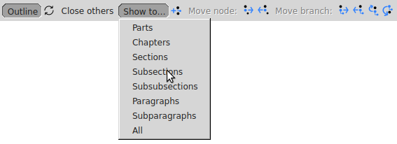

“Outline mode” plugin for TeXmacs : easy reorganization of documents
-------------------------------------------------------------

This plugin makes it easy to control the display of the hierarchical structure of a complex document and enables reorganizing its parts in a structure-aware manner. For instance you can move a section together with its subsection, or consistently change their level in the hierarchy as a whole.

Such features bring to TeXmacs the equivalent of the “outline mode” or “navigator” found in well-known word processors.

## How it works - user side

The plugin transforms all sectional tags in a document into outline-fold tags. These outline-fold tags have a “header part” and a “body” part. The body is visible only when the tag is unfolded, and it contains all the text that belongs structurally to the initial sectional tag, including outline-fold tags for any existing subsection. The resulting structure is similar to that aimed by the structured-sections package, with the added convenience of the folding mechanism. In this mode, selecting part of the text will automatically select its substructure. It is then very easy to rearrange the document by moving around structured blocks of text by cut & paste. Note that the document content remains entirely editable in this mode. It can be saved in this state, reopened later, etc.

<table style="width: 100%">
<colgroup>
<col style="width: 50%" />
<col style="width: 50%" />
</colgroup>
<tbody>
<tr class="odd">
<td style="text-align: center;" style="width: 50%; padding-left: 0em">
Normal mode document

(get it <a href="https://raw.githubusercontent.com/richi235/bachelor-thesis-link-aggregation-tunneling/master/main_thesis.tm">here</a>, mentioned in <a href="https://texmacs.github.io/notes/docs/example-documents.html">texmacs.github.io/notes</a>)
</td>
<td style="text-align: center;" style="width: 50%; padding-right: 0em; vertical-align: middle">
Same <a href="https://raw.githubusercontent.com/richi235/bachelor-thesis-link-aggregation-tunneling/master/main_thesis.tm">document</a> in Outline mode
</td>
</tr>
<tr class="even">
<td ></td>
<td ></td>
</tr>
</tbody>
</table>

### Outline Toolbar

As can be seen on the above images, the plugin provides a toolbar with various buttons for controlling the visibility of the hierarchical structure at the level of the whole document, and, with the mouse, one can open or close any part as desired. Another series of buttons allow to move branches or node of the document's tree structure, for reorganizing it. Note that these buttons can reorganize nested lists too.

While in the “outline mode” (left-most button “pressed”), the rendering of the document is modified to make it more compact (in order to get a “broader view” of the structure).

When reorganizing is done and the outline mode is no longer needed, one simply toggles the outline mode button and the outline-fold tags are removed, recovering a “standard” document with it's initial style and formatting..

### Toolbar buttons

When installed the plugin loads automatically at startup and you can activate the toolbar either from the `Tools` menu or by the keyboard shortcut `Ctrl-Shift-o` (think “Outline”). The different buttons on the toolbar are :

`Outline` Toggles the outline mode (makes the document hierarchical with outline folds).

 Refresh the hierarchy of elements in the current branch to make the fold nesting consistent with the logical structure. This is useful after performing manual modifications which break the hierarchy.

`Close others` Closes all folds except those needed for the cursor to be visible.

`Show to ...` Select the hierarchy depth you want to see.

 Insert new sectional tag at a level consistent with the cursor position. If some text is selected, makes it the new section header or list item. Works only in outline mode. While the buttons described below also operate on list-like tags, this one does not add items to lists; it only inserts sectional tags..

 \|  Downgrade \| Upgrade the current section (or list item) in the 
hierarchy, leaving its substructure at the level it was.

 \|  Downgrade \| Upgrade the current section (or list item) in the hierarchy, **together with** its substructure.

 \|  Move Up \| Down the current section (or list item) in the hierarchy, **together with** its substructure, if possible. This operation only changes the order of appearance of subitems present at a given node of the structure.

## Installation

Copy the `outline` folder to your `~/.TeXmacs/plugins` user folder and restart TeXmacs (If you want to find the exact location of your TeXmacs home folder in your system [use this file](https://raw.githubusercontent.com/texmacs/tm-forge/main/miscellanea/find-your-texmacs-paths.tm).). In case the menu item and shortcut are not immediately available, do `Tool→Update→Plugins`.

If you want to change the keyboard shortcut to bring up the toolbar, you can edit it in the `~/.TeXmacs/plugins/outline/progs/init-outline.scm` file.

## Limitations & Warning

**Beware that this plugin has not been extensively tested; it could very well crash TeXmacs** (I crashed it *a lot* during development of the plugin), **mess up your text or even eat it** (check carefully at each step that the operation performed correctly). **Do not blindly trust this plugin when you work on a critical task with a tight schedule.** To be on the safe side, use version control or backup your precious document (as you always do, isn't it?).

The code works on single files. It cannot reorganize a multi-document book from the master file.

Although the plugin works reasonably well for “clean” documents, the algorithm will likely fail if the tag structure of the initial document is unexpected, or it you have macros playing tricks with sectional tags. When outlining a document, the algorithm only tries to identify a few real or potential problems. For instance, it will signal when a section tag and the following chapter tag are both enclosed in a “with” tag invisibly setting a variable (the algorithm will presently not split such “with”). Even if the conversion to folds can proceed without error in such case, it yields an incorrect hierarchical structure that cannot be modified appropriately in outline mode. As well, if you insert special tags in your documents, (e.g. to manually reset a counter before a sectional tag) they may not get “linked” to the section you wanted them to apply to.

## How it works - coder side

Although the logical hierarchical structure of the document is obvious to the reader, this structure is only *implicit*. TeXmacs' internal data representation of the document merely reflects the tags present in the document, and although tags are nested in a tree-like structure (just like Xml), the hierarchical structure of this tree is *not* the logical structure we attribute to the document. Actually, in simple TeXmacs documents, all sectional tags are at the same level in a single `document` tag[\[1\]](#my-anchor), which is also the level of the body text (and the outlining algorithm needs such a flat initial structure).

The code works out the initial *implicit* logical structure, and transforms the internal tree representation TeXmacs has of the document, making the hierarchy explicit with the outline-folds tags. It does so progressing backwards from the end of the document, one section at a time, enclosing parts that are hierarchically lower (and which have already been transformed into outline-folds). Amusingly, manipulating TeXmacs' data tree is conceptually similar to manipulating parts of the document in outline-mode.

On the style side, the “body” part of the folds is rendered as a `document` tag (see its definition in outline.ts), so that all the elements of the original `document` tag can go directly in. The down side is that editing the text in outline mode will tend to introduce spurious `document` tags in outline folds; The code removes them when refreshing or reorganizing, in order to keep a consistent structure. The “section-outline” style package is loaded only while in outline mode. Its purpose is to reduces all vertical spaces surrounding sectional tags (otherwise preserving their aspect), so that more of the structure can fit onto the screen.

The code is quite complex, not optimized in any way, and certainly very bad or fragile in some places. Part of this is due to developing it gradually, with a lot of after-thought and bug-fixing rework.

## Reporting Outline plugin bugs

If you find a reproducible way to have the plugin misbehave with a document, please **do not** report it to TeXmacs' official bug tracker. Instead, you may file a bug report at [tm-forge](https://github.com/texmacs/tm-forge/issues), attaching to your report *a maximally simplified version* of your *non-outlined* document that allows reproducing the bug and explain the steps to reproduce it (Do not report issues with arbitrarily large or complex documents and/or with custom style macros, they will not be investigated).

----
<a id="my-anchor">[1]</a>: The `document` tag is a [fundamental TeXmacs primitive](https://texmacs.org/tmweb/manual/webman-primitives.en.html) corresponding to stacking vertically various elements (e.g. different paragraphs) on the page. However, this tag may be mysterious for beginning TeXmacs hackers since it is hardly ever visible. For instance, when viewing a document's data tree using `Document→Source→Edit`, no `document` tags are seen, because the default is to render them only implicitly, through the layout. The same is true for the `concat` tag, which corresponds to horizontal stacking. Similarly, in `.tm` files, the presence of these tags is marked only through strictly codified use of spaces and newlines  (which explains why editing these files in a raw text editor is prone to break the document's data tree). When one needs clarification on the full tree structure, the presence of these elusive tags can be made explicit by selecting `Document→Source→Preferences→Tags with special rendering→raw`, or by transforming the text to TeXmacs scheme (using save as…, or copy to…).
