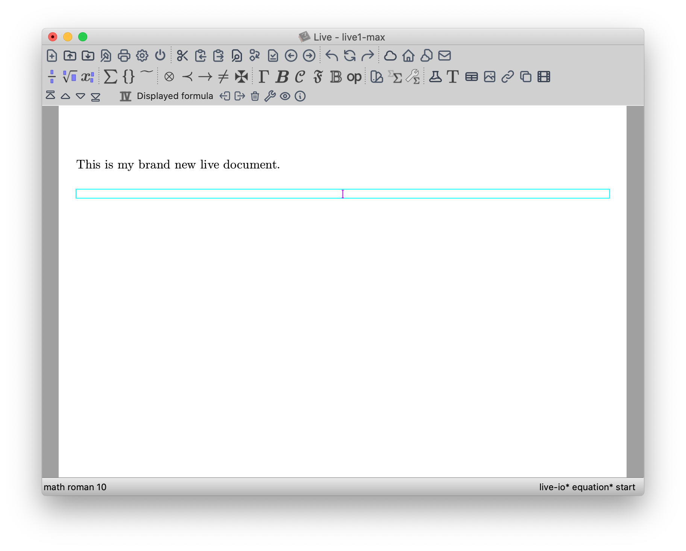

# tm-forge/miscellanea/post-modern-icons

A "post-modern" icon style for TeXmacs.

(c) 2021 Massimiliano Gubinelli

This is an iconset which (partially so far) replace TeXmacs standard icons.

It is based on the [heroicons](https://github.com/tailwindlabs/heroicons) icon set 
(Copyright (c) 2020 Refactoring UI Inc. - MIT license)



## Installation

Just copy all the PNG files into `$TEXMACS_HOME_PATH/misc/pixmaps/`. TeXmacs will pick them up automatically. You might have to refresh the image cache, e.g. by executing
```
rm -rf $TEXMACS_HOME_PATH/system/cache
```

## Developing

Icon sources are in the `src/` directory in SVG format. You can copy and modify an existing icon or just try to look into the original `heroicons` set for inspiration. A `Makefile` is included to automatically generate all the necessary PNG files (in 3 sizes: x1,x2,x4). If you add more icons, remember to also update the icon list in the `Makefile`. You need `Inkscape` installed on you machine for generating the PNG files from the SVG files and maybe you have to tweak the `Inkscape` path in the `Makefile`.


