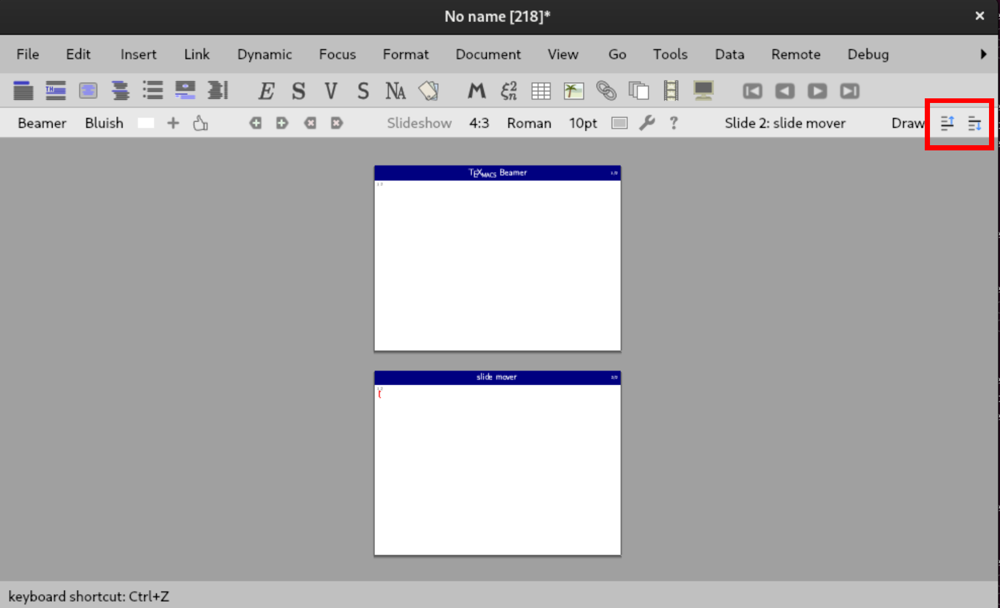

TeXmacs plugin to move beamer slides around
------------------------------------

When this plugin is installed, two icons will appear on the focus toolbar of 
Beamer documents in paper or panorama view. These buttons allow to move slides
up and down in the presentation.

