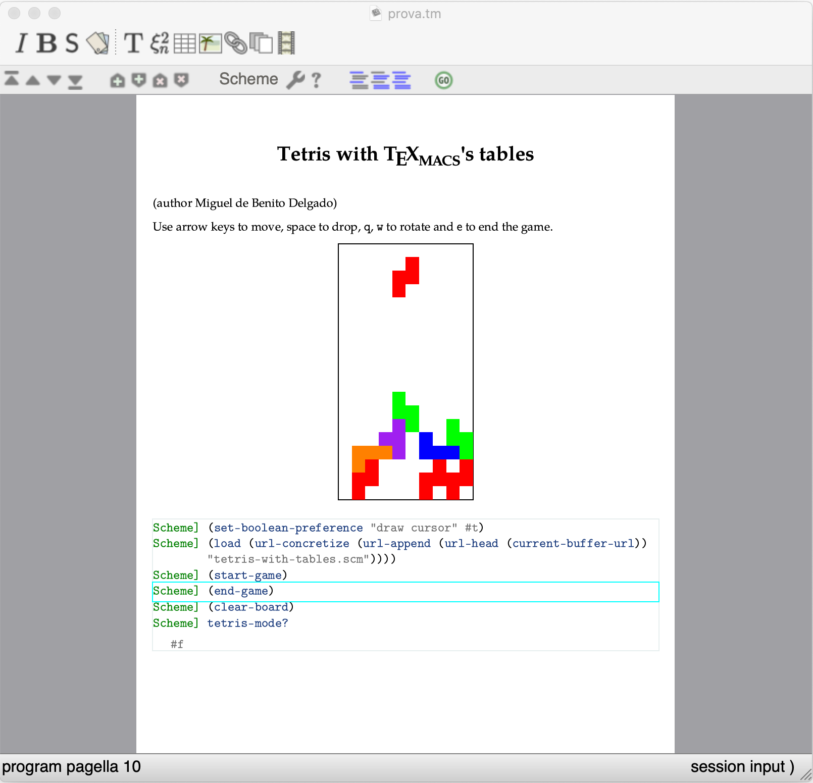

# Tetris with TeXmacs tables

This example is taken from a presentation of Miguel de Benito

The TeXmacs source loads the scheme file which defines the procedures needed to play tetris. The game surface is implemented via a document table and the tiles by changing the color of the cells. This is not the most efficient implementation but it is a nice example of several features of TeXmacs:

* handle keyboard interaction in a context-dependent way
* programmatically modify a document
* schedule actions to a later moment

Enjoy!

mgubi
