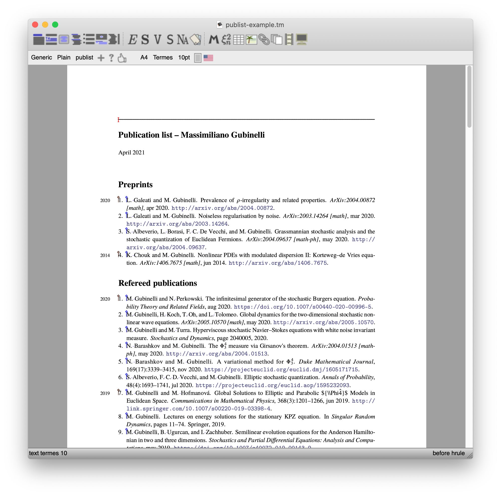

# publist

A TeXmacs bibliography style to typeset publication lists

Version 0.1 -- (c) 2021 Massimiliano Gubinelli

This plugin installs the bibliography style `tm-publist` and the style package `publist.ts` which allow to typeset publication list in a form suitable for curricula or similar documents. The entries are ordered in descending order of time with optional sectioning with respect to the year of publication.

### Example of use

A screenshot of the document [examples/publist-example.tm](./examples/publist-example.tm) opened in TeXmacs.

In this case the bibligraphy database is contained in the document itself and the various entries are selected via `\nocite` tags in the preamble. Note the use of the `\with-bib` tag to create various bibliographic collections (Preprints, Papers, Books, etc...)

### TODO
* Add options to reverse the ordering
* ...

