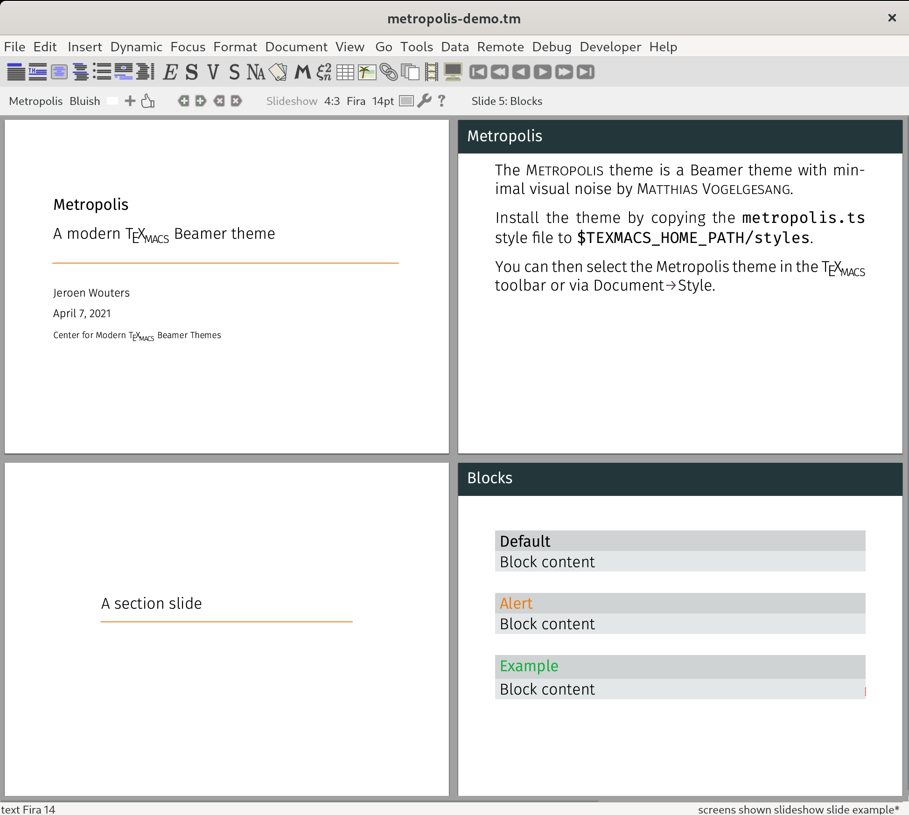

# TeXmacs Metropolis

A simplistic clone of the Beamer [Metropolis theme](https://github.com/matze/mtheme) by Matthias Vogelgesang

To add a title slide, use the `<title-slide>` tag. To add a section slide, use the `<section-slide>` tag. The style file contains a `small-caps` variable that you can use to switch the slide title to small caps.

### TODO

* Margins
* Blocks
* Footer (page number)
